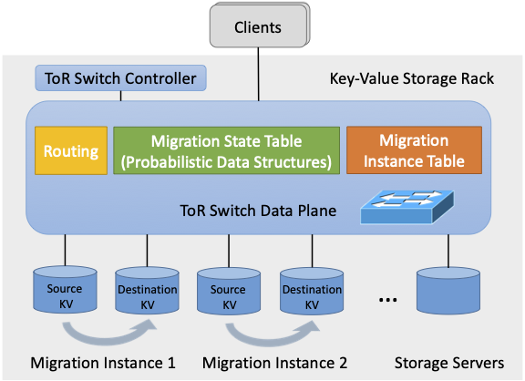

# In-Memory Key-Value Store Live Migration with NetMigrate

NetMigrate is a key-value store live migration protocol by leveraging programmalbe switches. NetMigrate migrates KVS shards between nodes with zero service interruption and minimal performance impact. During migration, the switch data plane monitors the migration process in a fine-grained manner and directs client queries to the right server in real time.

## FAST’24 Artifact Evaluation Only
For FAST Artifact Evlauation, we provide a local testbed with everything installed. Please share your ssh public key for evaluation via HotCRP.

### Run Migration with Four Protocols
0. Setup environment variables.
```
export $NetMigrate=~/fast_ae/NetMigrate/
```
Notes: 
1. Before running a new experiment, kill and restart previous redis-server in both source and destination servers.
2. Before running a new NetMigrate experiment, ctrl-C the switchd and controller program and restart switchd and controller on the switch using commands in [Tofino switch P4 code and controller README](tna_kv_migration/README.md).
3. The actual hardware is different, so the performance will change.
* [Rocksteady](experiment_steps/Rocksteady.md)
* [Fulva](experiment_steps/Fulva.md)
* [Source-migration](experiment_steps/Source.md)
* [NetMigrate](experiment_steps/NetMigrate.md)


## Content
* cpp/
    * server/: 4 migration protocols' server agents.
    * YCSB-client/: YCSB client implementation for 4 migration protocols.
    * utils/: Common utils.
* tna_kv_migration/: Switch data-plane and control-plane code for NetMigrate. 
* experiment_steps/: Experiment step README.
* README.md: This file.

## Testbed experiments
* Hardware 
   * A Barefoot Tofino switch.
   * At least 3 servers each with a NIC (we used an Intel XL710 for 40GbE QSFP+) and multi-core CPU, connected by the Tofino switch.
* Software
   * Tofino SDK (version 9.4.0) on the switch.
   * Python2.7 on the switch.
   * gRPC 1.50.0 and protobuf 3.21.6.0 for PriorityPulls in KV servers.

**Experimental setup:** We use one source-destination KVS pair, one client, and a ToR switch in the evaluation. 

<p align="center">
  
</p>

## Installation
### 1. Pre-Requirments for Redis in Source and Destination servers

* Install Redis with User-Defined Migration Functions 
    ```
    git clone https://github.com/zzylol/redis.git
    cd redis
    git checkout -b KVMigration-7.0 origin/KVMigration-7.0
    make && sudo make install 
    ```
* Install [gRPC and Protocol Buffers](https://grpc.io/docs/languages/cpp/quickstart/).
* Install [redis-plus-plus and hiredis](https://github.com/sewenew/redis-plus-plus?tab=readme-ov-file#installation)
* Install [cpulimit](https://github.com/opsengine/cpulimit?tab=readme-ov-file#install-instructions) (optional, for load-balancing scenario experiments)

### 2. Compile Migration Agents in Source and Destination KVS Servers
Build Fulva baseline:
```
cd $NetMigrate/cpp/server/Fulva/
mkdir build && cd build
cmake -DCMAKE_PREFIX_PATH=$GRPC_INSTALL_DIR ..
make 
```

Build Rocksteady baseline:
```
cd $NetMigrate/cpp/server/Rocksteady/
mkdir build && cd build
cmake -DCMAKE_PREFIX_PATH=$GRPC_INSTALL_DIR ..
make 
```

Build source-migration baseline:
```
cd $NetMigrate/cpp/server/Source-protocol/
cd server_agent
make
cd ../migration_agent_udp
mkdir build && cd build
cmake ..
make
```

Build NetMigrate: 
```
cd $NetMigrate/cpp/server/NetMigrate/
mkdir build && cd build
cmake -DCMAKE_PREFIX_PATH=$GRPC_INSTALL_DIR ..
make 
```

### 3. Compile YCSB Clients in Client Servers
[YCSB-client REAMDE](cpp/YCSB-client/README.md)
```
cd $NetMigrate/cpp/YCSB-client
make BIND_KVMIGRATION=1 # build NetMigrate client
make BIND_FULVA=1 # build Fulva client
make BIND_ROCKSTEADY=1 # build Rocksteady client
make BIND_SOURCE=1 # build Source-based migration client
```

### 4. Compile and Run Switch Code in Switch
[Tofino switch P4 code and controller README](tna_kv_migration/README.md)

(**Note for FAST'24 artifact evaluation process**: We can provide testbed with Tofino SDK installed if needed.)

## Run Migration Experiments  

### 1. Load YCSB Data to Source Redis-server
(**Note for FAST'24 artifact evaluation process**: We provided a ```dumb.rdb``` Redis snapshot in the source server and loading it to the source redis-server takes only **~3 min** by 
```cd ~; redis-server --protected-mode no --port 6380 --save "" --appendonly no &```, which will load dumb.rdb into redis-server with port 6380.)


If you want to load from YCSB clients (Loading 256 million kv pairs needs about about **2h** in our testbed. Check if the source Redis is still loading data from whether the CPU usage of it is ~0% and memory is ~33GB):

1. With Redis rdb and aof enabled 
```
redis-server --protected-mode no --port 6380 &
```

2. Start Source Request Server Agents
Note: 
* change ```server_agent_start_port``` and ```thread_num``` in bash files to the same as YCSB client ```agent_start_port``` and ```thread_num``` properties if needed.

In source server:
```
cd $NetMigrate/cpp/server/ServerAgents/server-agent
make 
bash start_src_server_agent.sh # do this at source server
```

3. run YCSB client load
   
Note: we use Rocksteady's client to load data to source redis-server for all migration protocols.

In source server, load 256 million key-value pairs, each with 4-Byte key and 64-Byte value:
```
cd $NetMigrate/cpp/YCSB-client 
make BIND_ROCKSTEADY=1
./ycsb-rocksteady -load -db KV -P workloads/workloada -P Rocksteady/load.properties -p threadcount=4 -p recordcount=256000000 -s # load data first
```


### 2. Run Migration with Four Protocols
Notes: 
1. Before running a new experiment, kill and restart previous redis-server in both source and destination servers.
2. Before running a new NetMigrate experiment, ctrl-C the switchd and controller program and restart switchd and controller on the switch using commands in [Tofino switch P4 code and controller README](tna_kv_migration/README.md).
* [Rocksteady](experiment_steps/Rocksteady.md)
* [Fulva](experiment_steps/Fulva.md)
* [Source-migration](experiment_steps/Source.md)
* [NetMigrate](experiment_steps/NetMigrate.md)

## License
The code is released under [GNU Affero General Public License v3.0](LICENSE).
