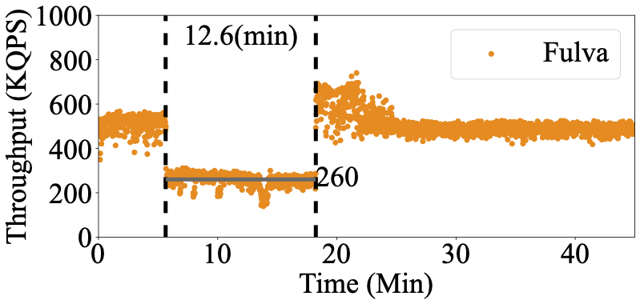
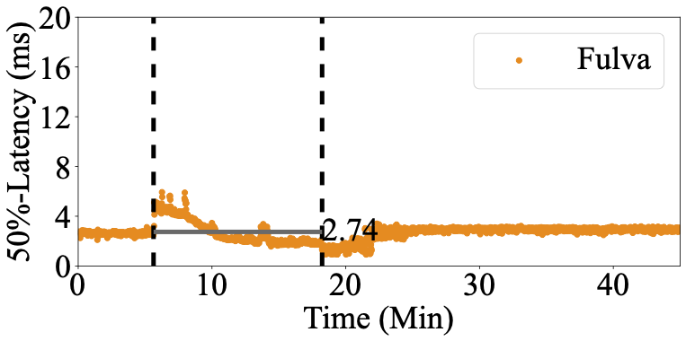
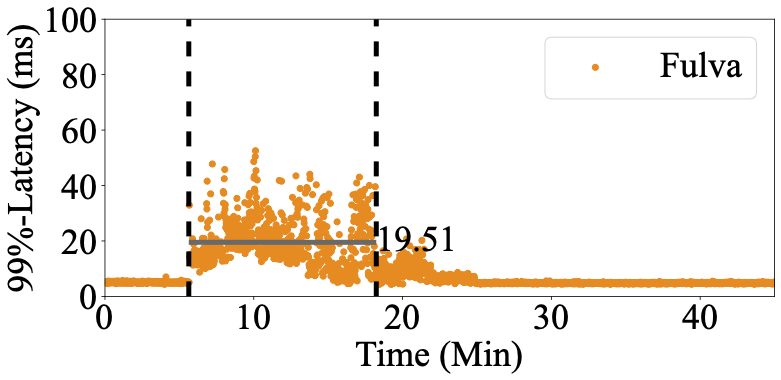

# Run Migration  

## Start destination redis-server 
In destination:
```
ps aux | grep redis # check existing redis-server
sudo kill -9 xxxx (redis pid)
redis-server --protected-mode no --port 7380 --save "" --appendonly no&
```

## Start source priority pull server
```
cd NetMigrate/cpp/server/Fulva
bash run_src_pull.sh
```

## Start destination migration agent
Run destination script first.
```
cd NetMigrate/cpp/server/Fulva
bash run_dst.sh
```


## Run YCSB Clients
```
cd NetMigrate/cpp/YCSB-client
./ycsb-fulva -run -db KV -P workloads/workloadb -P Fulva/kv_migration.properties -p threadcount=8 -s > ~/result/fulva-b-100%.txt
```

## Start source migration push to migrate data

After running client of about 200 seconds, in another terminal in source server:
```
cd NetMigrate/cpp/server/Fulva
bash run_src_push.sh
```

After migration finishes, you will get Fulva throughput figure(Figure 4(b) in the paper) and latency figures (Figure 5(b) and 6(b) in the paper).

Throughput:

<p align="center">
  
</p>

Median latency:

<p align="center">
  
</p>

99%-tail latency:

<p align="center">
  
</p>

## Limit Source Redis CPU
If limiting source Redis CPU to mimic load-balancing scenario, e.g., 70% and 40% source redis CPU limit:

use this:
```
ps aux | grep redis
cpulimit -p 1234 -l 70
```

```
ps aux | grep redis
cpulimit -p 1234 -l 40
```

