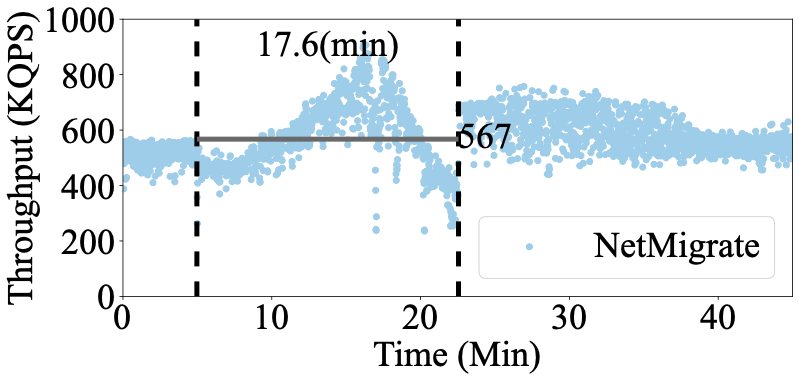
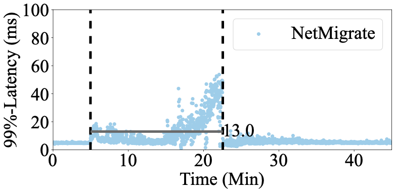

# Run Migration  

## Start redis-server 
In destination (netx5):
```
ps aux | grep redis # check existing redis-server
sudo kill -9 xxxx (redis pid)
redis-server --protected-mode no --port 7380 --save "" --appendonly no&
```

## Restart Switchd and controller

## Start source priority pull 
In source server (netx7):
```
cd $NetMigrate/cpp/server/NetMigrate
bash run_src_pull.sh
```

## Start destination migration agent
In destination server (netx5):
```
cd $NetMigrate/cpp/server/NetMigrate
bash run_dst.sh
```

## Start source migration push to migrate data
In another terminal in the source server (netx7):
```
cd $NetMigrate/cpp/server/NetMigrate
bash run_src_push.sh
```

## Run YCSB Clients Immediately
(because we start migration after 300 sec in NetMigrate server agent code.)
In client server (netx4):
```
cd $NetMigrate/cpp/YCSB-client
./ycsb-kv_migration -run -db KV -P workloads/workloadb -P kv_migration/kv_migration.properties -p threadcount=8 -s > ~/result/netmigrate-b-100.txt
```

After migration finishes, you will get the raw data output ```~/result/netmigrate-b-100.txt``` in client server. You can draw throughput and latency figures from it using ```$NetMigrate/experiment_steps/figures/draw.py```. The trend in the figures will be similar as the below examples.
```
cp ~/result/netmigrate-b-100.txt $NetMigrate/experiment_steps/figures/
cd $NetMigrate/experiment_steps/figures/
mkdir latency_fig
mkdir thorughput_fig
python3 draw.py netmigrate b 100
```


Throughput:

<p align="center">
  
</p>

Median latency:

<p align="center">
  
</p>

99%-tail latency:

<p align="center">
  
</p>

## Limit Source Redis CPU
If limiting source Redis CPU to mimic load-balancing scenario, e.g., 70% and 40% source Redis CPU limit:

use this:
```
ps aux | grep redis
cpulimit -p 1234 -l 70
```

```
ps aux | grep redis
cpulimit -p 1234 -l 40
```
Note: for Figure 7 in the paper, we run NetMigrate-long policy with limited CPU in the source Redis.


