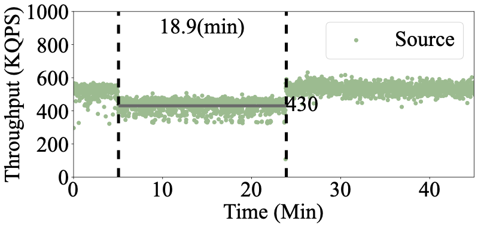
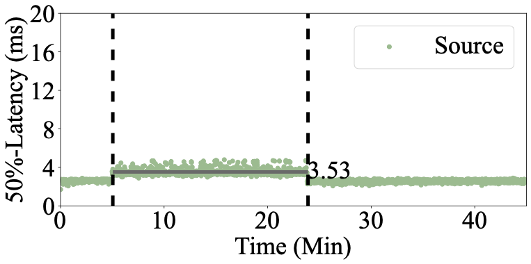
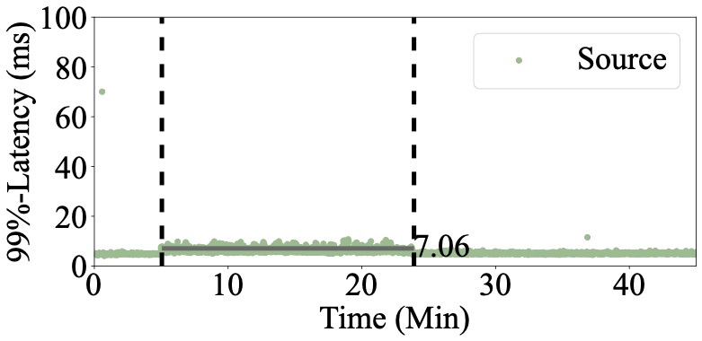

# Run Migration  

## Start redis-server 
In destination server:
```
ps aux | grep redis # check existing redis-server
sudo kill -9 xxxx (redis pid)
redis-server --protected-mode no --port 7380 --save "" --appendonly no&
```


## Start destination priority pull 
In destination server:

```
cd KV_Migration/cpp/server/Source-protocol/
bash destination_migr.sh
```

In another terminal in destination server:
```
cd NetMigrate/cpp/server/Source-protocol/server_agent/
bash start_dst_server_agent.sh
```


## Start source migration script
In source server:
```
cd NetMigrate/cpp/server/Source-protocol/
bash source_migr.sh
```


## Run YCSB Clients Immetiately
In client server:

```
cd NetMigrate/cpp/YCSB-client
./ycsb-source -run -db KV -P workloads/workloadb  -P Source/run.properties -p threadcount=8 -s > ~/result/source-b-100%.txt
```

After migration finishes, you will get Source-protocol throughput figure(Figure 4(c) in the paper) and latency figures (Figure 5(c) and 6(c) in the paper).

Throughput:

<p align="center">
  
</p>

Median latency:

<p align="center">
  
</p>

99%-tail latency:

<p align="center">
  
</p>


## Limit Source Redis CPU
If limiting source Redis CPU to mimic load-balancing scenario, e.g., 70% and 40% source redis CPU limit:

use this:
```
ps aux | grep redis
cpulimit -p 1234 -l 70
```

```
ps aux | grep redis
cpulimit -p 1234 -l 40
```

